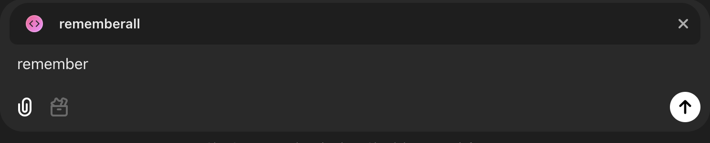
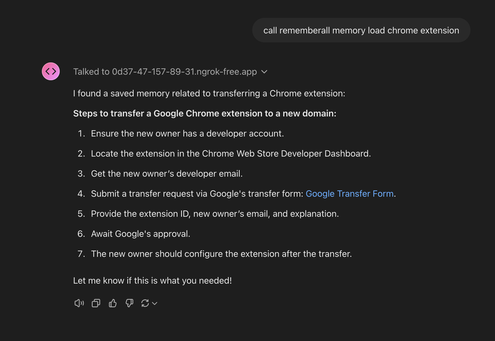
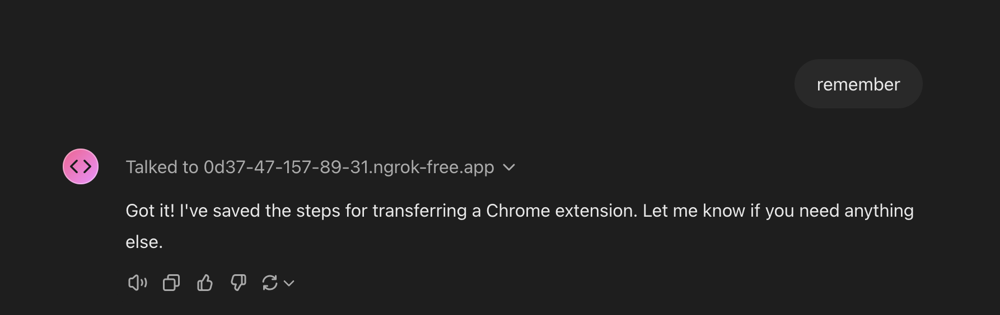
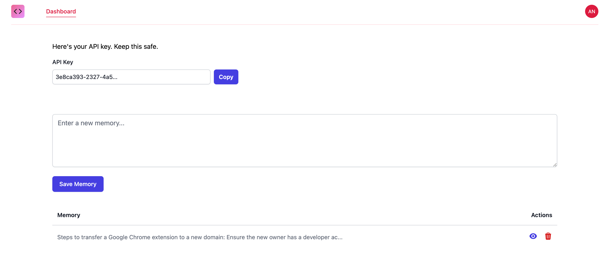

# rememberall 🔮

A secure, open-source long-term memory solution for GPT Store builders and AI developers. Just mention `@rememberall` in your custom GPT to unlock persistent memory across conversations.

## For GPT Builders

1. Install from GPT Store
2. Add to your custom GPT's configuration using `./api/openapi.yaml`
3. Your GPT now has persistent memory!

### How It Works

#### 1. Store Memories

*Your GPT can store important information from conversations*

#### 2. Load Past Context

*Easily retrieve relevant memories when needed*

#### 3. Natural Interactions

*Seamless integration with conversation flow*

#### 4. Manage Memories

*Intuitive dashboard for memory management*

```typescript
// Example usage in your GPT's system prompt
When user mentions past conversations, use @rememberall to recall context:
User: "What did we discuss about authentication last week?"
Assistant: Let me check @rememberall
Assistant: According to our previous discussion, we implemented JWT-based auth...
```

## For Developers

### Features
- 🔒 **Privacy-First**: Self-host your memory store
- 🚀 **Vector-Based**: Efficient semantic search
- 🔗 **Easy Integration**: Simple REST API
- 📦 **Open Source**: Customize and extend as needed

### Quick Start

1. Deploy using Docker Compose:

```bash
git clone https://github.com/yourusername/rememberall.git
cd rememberall
docker-compose up -d
```

2. Available API Endpoints:

```http
# List or search memories
GET /memories?search=query&limit=10&offset=0

# Create new memory
POST /memory
{
    "memory": "Your memory text here"
}
```

3. Authentication:
- All endpoints require Bearer token authentication
- Include token in requests: `Authorization: Bearer your-jwt-token`

### API Response Examples

Get Memories:

```json
{
    "success": true,
    "memories": [
        {
            "id": "mem_123",
            "memory": "Discussion about authentication systems"
        }
    ]
}
```

Create Memory:

```json
{
    "success": true,
    "memory": {
        "id": "mem_124",
        "memory": "New project requirements discussion"
    }
}
```

## Architecture & Security
- End-to-end encryption
- Self-hosted vector storage
- Fine-grained access control
- GDPR-compliant data handling